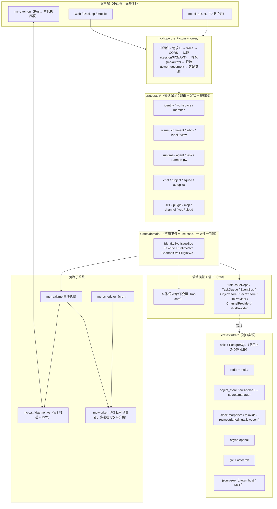
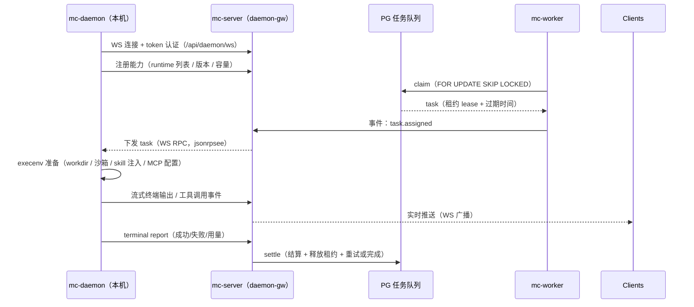

# plan1.md — multica (Go) → multica-rs (Rust) 完整迁移方案

> 版本 v1.0 ｜ 2026-09-22 ｜ 作者：编程助手devbox5 ｜ 状态：提案（待 master 评审）
>
> 本文件是**替代性总方案**：`docs/01-PLAN.md` 的 M0–M10 骨架保留，但本文件修订其**代码规模假设、crate 粒度、schema 策略、验收门禁**（差异见 §9）。
>
> 所有数字均来自实测，可复算（复算命令见 §10.4）。上游快照：`github.com/louloulin/multica` @ `main` = `f41fae6b08fb734afcbd13205c0b3203dd0bc9c6`。

---

## 0. 结论速览（一页纸）

| 问题 | 结论 |
| --- | --- |
| 上游到底多大？ | **约 21 万行 Go（非测试）+ 41.4 万行 Go 测试**，456 条 HTTP 路由，560 个 up 迁移 + 138 张表，CLI 70 个命令文件，前端 2300+ TS/TSX 文件 |
| 我们到哪了？ | 17 crate / 1.92 万行 Rust / 4 个迁移 / 28 张表；HTTP 覆盖率 **43/440 = 9.8%** |
| 目标 crate 数？ | **38–48 个**（不是 120）。一个 Cargo workspace，`crates/{platform,domain,infra,api}/<pkg>` 多包目录；**领域内多概念用 module，不用新包** |
| 数据层选什么？ | **sqlx 0.9**（对齐上游 sqlc 的"显式 SQL"哲学）+ **逐字复用上游 560 个迁移文件**；不引入 ORM |
| Web 层？ | **axum 0.8 + tower 0.5 + tower-http 0.7**（对齐 chi v5 的 middleware 语义） |
| 能不自研就不自研？ | 是。48 个域全部先查 crates.io，选型见 §4；**仅 3 处**确认需自研（PG 任务队列薄层、daemon 执行环境、上游契约 DTO）并登记 ADR |
| 总工时（单人）？ | **≈ 41–43 人周**（原 plan 的 30 周偏低约 40%）；3 路并行墙钟 ≈ 15–17 周 |
| 最大风险？ | schema 漂移、daemon/execenv 跨平台长尾、26 个 runtime adapter、**无 CI** |
| 立刻要做？ | W0 五件事：CI、schema 逐字复刻+drift 对账、路由对账入 CI、golden fixture 抽取、workspace 重构 |

---

## 1. 上游 multica 全景测绘

### 1.1 仓库结构

```
multica/
├─ server/                    ← 迁移主体（Go 1.26.6）
│  ├─ cmd/
│  │  ├─ multica/             CLI 主程序（70 个 cmd_*.go，~29 个命令组）
│  │  ├─ migrate/             迁移器（含并发/索引退役/重试等 16 个测试）
│  │  ├─ maintenance/         维护任务
│  │  └─ backfill_*/          4 个历史回填工具
│  ├─ internal/               handler/service/daemon/integrations/...
│  ├─ pkg/                    14 个公共包（agent/llm/protocol/plugincontract/...）
│  ├─ migrations/             1,120 文件 = 560 up + 560 down
│  ├─ sqlc.yaml                → SQL 生成类型化 Go（无 ORM）
│  └─ go.mod
├─ apps/     web / desktop / mobile / docs / ui-lab    （TS/TSX，不迁移）
├─ packages/ core / ui / views / plugin-sdk / eslint-config / tsconfig
├─ deploy/   helm chart + docker-compose + Dockerfile(.web)
└─ .github/workflows/  6 个：ci / release / desktop-smoke / mobile-verify / ui-performance / openclaw-config-smoke
```

### 1.2 后端代码规模实测（非测试）

| 子系统 | 文件 | LOC | 迁移含义 |
| --- | ---: | ---: | --- |
| `internal/handler` | 125 | **75,707** | REST 主战场，对应我们的 `crates/api/*` |
| `internal/integrations` | 153 | **48,907** | wecom 89 / dingtalk 76 / lark 72 / channel 42 / slack 32 / telegram 23 / ghsnapshot 7 / composio 6 / vcs 4 —— **最长的长尾** |
| `internal/daemon` | 84 | **45,571** | 执行环境（`execenv/` 99 文件：codex/cursor/claude 的 home/sandbox/skill 注入/MCP），**护城河所在** |
| `internal/service` | 40 | **20,629** | 业务编排 |
| `internal/realtime` | 7 | 2,973 | 事件总线 + WS |
| `internal/cli` | 9 | 2,834 | CLI 支撑库（非 cmd） |
| `internal/scheduler` | 7 | 2,094 | cron / 定时派发 |
| `internal/auth` | 9 | 1,733 | session/PAT/JWT |
| `internal/middleware` | 12 | 1,570 | chi 中间件链 |
| `internal/daemonws` | 3 | 1,370 | daemon ↔ server WS RPC |
| `internal/analytics` | 3 | 1,165 | 产品分析 |
| `internal/storage` | 4 | 919 | 对象存储 |
| `internal/seatcapacity` | 3 | 909 | 席位/配额 |
| `internal/entitlement` | 5 | 751 | 权限/套餐 |
| 其余 20+ 小目录 | — | ~2,000 | metrics/util/testutil/events/... |
| **合计** | | **≈ 209,300** | |

测试：**414,268 行 Go 测试**（1,121 个 `_test.go`）。这是最大的资产：**行为等价的 oracle 在这里**，而不是文档里。

### 1.3 HTTP 路由分布（456 条，其中 `/api`+`/auth` 440 条）

| 前缀 | 条数 | 前缀 | 条数 |
| --- | ---: | --- | ---: |
| `/api/workspaces` | 69 | `/api/issue-views` | 5 |
| `/api/issues` | 54 | `/api/issue-statuses` | 5 |
| `/api/daemon` | **36** | `/api/integrations` | 5 |
| `/api/chat` | 25 | `/api/attachments` | 5 |
| `/api/agents` | 25 | `/api/cloud-runtime` | 11 |
| `/api/autopilots` | 20 | `/api/webhooks` | 4 |
| `/api/runtimes` | 17 | `/api/tokens` | 4 |
| `/api/skills` | 14 | `/api/squads` | 10 |
| `/api/inbox` | 14 | `/api/projects` | 10 |
| `/api/plugin-bridge` | 10 | `/api/comments` | 9 |
| `/api/labels` | 5 | `/api/me` | 7 |
| `/api/cloud-billing` | 8 | `/api/cloud-subscriptions` | 7 |
| `/api/dashboard` | 6 | 其他 | ~40 |

### 1.4 上游依赖清单 → Rust 等价物（迁移映射的起点）

| Go 依赖 | 用途 | Rust 对应 |
| --- | --- | --- |
| `go-chi/chi/v5` + `cors` | 路由/中间件 | axum + tower-http |
| `jackc/pgx/v5` + `sqlc` | 数据访问（显式 SQL） | **sqlx** |
| `go-redis/redis/v9` | 缓存/锁 | redis + deadpool-redis |
| `golang-jwt/jwt/v5` | JWT | jsonwebtoken |
| `google/uuid`, `oklog/ulid/v2` | ID | uuid, ulid |
| `gorilla/websocket` | WS | axum `ws`（内部 tungstenite） |
| `spf13/cobra` + `pflag` | CLI | clap 4 |
| `aws-sdk-go-v2`（s3/secretsmanager） | 对象存储/密钥 | aws-sdk-s3 / aws-sdk-secretsmanager（或 opendal） |
| `prometheus/client_golang` | 指标 | metrics + metrics-exporter-prometheus |
| `resend/resend-go` | 事务邮件 | reqwest（自建薄层）或 lettre（SMTP） |
| `slack-go/slack` | Slack | slack-morphism |
| `openai/openai-go` | LLM | async-openai |
| `robfig/cron/v3` | 定时 | cron + tokio-cron-scheduler |
| `yuin/goldmark` | Markdown | comrak |
| `tdewolff/parse` | HTML 解析 | lol_html / scraper |
| `go-resty/resty` | HTTP 客户端 | reqwest |
| `pelletier/go-toml`, `yaml.v3` | 配置 | toml, serde_norway |
| `lumberjack` | 日志轮转 | tracing-appender |
| `google.golang.org/protobuf` | 协议 | prost（+ tonic 如走 gRPC） |

### 1.5 现状基线 vs 目标（差距量化）

| 维度 | 现状（multica-rs） | 上游 | 覆盖率 |
| --- | ---: | ---: | ---: |
| Rust LOC | 19,177 | ~209,000 Go | 9% |
| crate | 17 | ~40 目标 | 42% |
| 迁移文件 | 4 | 560 up/560 down | 0.7% |
| 数据表 | 28（26 同名） | 138｜**head 114** | ≈23%（26/114） |
| HTTP 路由 | 43 真实 | 440 | **9.8%** |
| 测试 | 242 个（42 个 `#[ignore]`） | 1,121 文件 / 414k 行 | — |
| CI | **无** | 6 个 workflow | 0% |

> 数据表口径（2026-09-22 实测更正）：上游列 **138 = 迁移 `CREATE TABLE` 去重 137 + Go runner 自建的 `schema_migrations`**；其中 **24 张已被后续迁移 `DROP`** ⇒ **head 最终表集 = 114**，覆盖率按 head 口径 = 26/114 ≈ 23%。复算命令见 §10.4，机制说明见 §6.3.1。

---

## 2. 迁移策略总原则（P1–P5）

**P1 · 契约优先（三份契约，全部可机检）**

| 契约 | 来源 | 机器校验 |
| --- | --- | --- |
| HTTP 契约 | `server/cmd/server/router.go` + handler 响应 | `scripts/route_parity.py`（已立项 LUM-1376）+ **golden fixture**（新增） |
| 数据契约 | `server/migrations/*.up.sql`（560 个） | 逐字复用 + `information_schema` 快照 diff |
| 线协议契约 | daemon ws RPC、plugin JSON-RPC、事件 envelope | 上游 `pkg/protocol` / `pkg/plugincontract` / `eventcontract` 的字段表 → `serde` 结构 + round-trip 测试 |

**P2 · 库优先，自研需要 ADR 批准**
选库闸门：① crates.io 上存在维护活跃、下载量 >1M/月的成熟 crate → 必须用；② 需要自研时必须满足"无可用库 / 性能关键 / 契约特殊"之一，并写 `docs/adr/ADR-xxxx.md` 记录候选库与放弃理由。当前**仅 3 处**获批自研：

1. **PG 任务队列薄层**（上游是 `FOR UPDATE SKIP LOCKED` + advisory lock 语义，与现成队列库（apalis/River 移植）语义不匹配；自研 ~800 行，见 ADR-0003）
2. **daemon 执行环境 execenv**（codex/cursor/claude 的沙箱/home/skill 注入，无等价库）
3. **上游 DTO/契约结构**（字段名/可空性必须逐字对齐，不能由 ORM 生成）

其余一律用库：JSON-RPC 用 `jsonrpsee`（不自己写协议）、session 用 `tower-sessions`、rate limit 用 `tower_governor`、缓存用 `moka`、git 用 `gix`、GitHub 用 `octocrab`、Markdown 用 `comrak`、**插件宿主用 JSON-RPC 而非 wasmtime**（上游 `plugincontract` 就是 JSON-RPC，引 wasm 是自找麻烦）。

**P3 · 对齐上游范式，不"用 Rust 重设计"**
`s sqlc → sqlx`（显式 SQL、编译期校验）、`chi → axum/tower`、`cobra → clap`、`pgx pool → sqlx::PgPool`、`chi middleware → tower::Layer`。**凡上游有的语义都照搬，只换实现**；只有在 Rust 侧天然更优处（类型状态、所有权消除数据竞争）才偏离，且必须记录。

**P4 · schema 先行，不允许"顺手加表"**
上游 560 个迁移**逐字**放入 `migrations/upstream/`（只读，禁止改），必要时在 `migrations/compat/` 放兼容性补丁；`migrate` 命令应用两目录的合并序列。CI 跑 schema drift 对账（见 §6.3）。这条直接消灭"计划以为有表、实际没有"这类已发生两次的事故（label/properties）。

> ⚠️ **2026-09-22 实测更正**：本仓现有 runner（`mc-db` / `mc-migrate`）的迁移身份是**解析出的整数版本号（`BIGINT` 主键）**、顺序是**数值序**、且只吃**单目录** —— 与上游 runner（`TEXT` 键 = 文件名词干、`sort.Strings` 全路径字典序）三处都不兼容，而上游 560 个迁移里**只有 513 个互不相同的数字版本**（30 个版本带 2–4 个文件）。因此"按文件名字典序合并"这句话在当前实现上是**不成立的**，接管前必须先按 **§6.3.1 接管契约**改造，否则会在第 1 个迁移上就与本地 `0001_init` 撞键。

**P5 · 用上游测试当 oracle**
414k 行 Go 测试逐子系统抽取为 **golden fixture**（HTTP 请求/响应 JSON 对、SQL 期望结果、事件 envelope），Rust 侧以 `insta` 快照断言。覆盖率不看行数，看**通过的 fixture 数 / 上游用例数**。

---

## 3. 目标架构

### 3.1 总体架构（分层 + 端口适配）



ASCII 备份（同一张图的纯文本版）：

```
Web/Desktop/Mobile   mc-cli        mc-daemon ─┐
        │                │                    │ WS RPC
        └───────► axum + tower 中间件链 ◄──────┘
                          │
              crates/api/*（路由 + DTO，薄）
                          │
        crates/domain/*（应用服务 → 领域模型 → trait 端口）
                          │            ╲
                          │             ╲ 事件总线（realtime）
        crates/infra/*（sqlx/redis/s3/渠道/LLM/git/jsonrpc） → WS 推送 / worker / scheduler
```

### 3.2 模块与包的划分法则（回答"多模块设计 / 单 crate 下的多包设置"）

**先澄清 Rust 的三个概念**（这是设计里最容易搞错的地方）：

| 概念 | 物理形态 | 说明 |
| --- | --- | --- |
| **crate** | 一次编译单元 | 一个 `lib.rs`/`main.rs` = 一个 crate |
| **package** | 一个 `Cargo.toml` | 一个 package 默认含 1 个 lib crate + 0..n 个 bin crate（`src/bin/` 或 `[[bin]]`） |
| **module** | `mod` / 文件 | 同一 crate 内，**不是**编译单元，零编译成本 |

因此"**单个 crate 目录下放多个包**"在 Cargo 里只有三种合法实现，本方案的选择如下：

| 做法 | 形态 | 采用 |
| --- | --- | --- |
| ① 一个 package 多 target | `mc-server/src/lib.rs` + `src/bin/{server,worker,migrate}.rs`，或 `[[bin]]` | ✅ 采用（server/worker/migrate 共享 lib，避免拆包） |
| ② 嵌套目录多 package | `crates/domain/mc-issue/{Cargo.toml}`、`crates/domain/mc-runtime/{Cargo.toml}`… 用 **workspace glob members** 声明 | ✅ 采用（这就是"`crates/` 下的多包"） |
| ③ 真·一个目录挂多个 package | 同目录多个 `Cargo.toml` | ❌ 禁止（Cargo 不支持，社区无此约定，只会造成混乱） |

**粒度三条硬法则**（用来压制"120 crate"的过度拆分冲动）：

- **R1 拆包三条件**（满足其一才拆成独立 package）：① 需要**编译期强制依赖方向**（防回环）；② 需要**可选依赖/feature 隔离**（如云厂商 SDK 只在 `cloud` feature 下编译）；③ 文件数 >~25 且改动频率高，拆包能显著缩短增量编译。
- **R2 领域内多概念 → module，不拆包**：`label / property / view / status / timeline` 全部是 `mc-issue` crate 的 module；`runtime-profile / runtime-catalog / runtime-quota` 全部属于 `mc-runtime`。
- **R3 上限**：**38–48 个 crate**。理由：Pernosco（48 crate / 8.5 万行）已出现"同一依赖被多个 crate 各自编译一份、版本漂移、构建放大"的真实痛点；Internet Computer 的经验是"**少包多模块**弹性更好"（模块可循环引用、增删成本低）。过度拆包只在有**构建农场 + 上千 crate**（Feldera 案例）时才划算，我们不具备也不必要。

**目录布局**：

```
multica-rs/
├─ Cargo.toml                     # 虚拟 workspace（无 package），members 用 glob
│   members = ["crates/platform/*", "crates/domain/*", "crates/infra/*",
│              "crates/api/*", "apps/*", "tools/*"]
├─ .config/hakari.toml            # crate 数 >40 后启用 feature 统一（见 §4.6）
├─ crates/
│  ├─ platform/    mc-config mc-errors mc-telemetry mc-db mc-storage mc-secrets
│  │               mc-auth mc-authz mc-realtime mc-ws mc-openapi mc-feature-flags
│  │               mc-migrate mc-worker
│  ├─ domain/      mc-core（实体/值对象）
│  │               mc-identity   ├─ src/{domain,ports,app,adapter}/
│  │               mc-issue      │   domain/  实体+不变量
│  │               mc-comment    │   ports/   trait（仓储/外部服务）
│  │               mc-inbox      │   app/     use case（一文件一用例）
│  │               mc-runtime    │   adapter/ 上游依赖的具体实现（薄）
│  │               mc-agent      │   dto/     上游契约 DTO（可 feature=contract）
│  │               mc-task       │   prelude.rs
│  │               mc-chat mc-project mc-squad mc-autopilot mc-skill
│  │               mc-channel mc-vcs mc-mcp mc-cloud mc-feedback mc-onboarding
│  ├─ infra/       mc-db-pg（sqlx 仓储实现） mc-cache-redis
│  │               mc-store-s3 mc-secret-aws
│  │               mc-channel-slack mc-channel-telegram mc-channel-lark
│  │               mc-channel-dingtalk mc-channel-wecom mc-channel-custom
│  │               mc-llm-provider mc-vcs-github mc-plugin-host
│  └─ api/         mc-http-core（中间件/错误映射/分页/提取器）
│                  mc-api-rest（路由装配，按域拆 module）
├─ apps/
│  ├─ mc-server/   src/lib.rs + src/bin/{server,worker,migrate}.rs   ← ① 一包多 target
│  ├─ mc-cli/
│  └─ mc-daemon/
├─ migrations/
│  ├─ upstream/    ← 上游 560 个 up 迁移，逐字，只读
│  └─ compat/      ← 必要的兼容补丁（少而小）
├─ contracts/      ← fixture：routes.tsv / golden/*.json / schema-snapshot.sql / envelope.schema.json
├─ scripts/        ← route_parity.py / gen_upstream_routes.py / schema_drift.py / extract_fixtures.go
└─ tests/          ← workspace 级集成测试（testcontainers）
```

### 3.3 crate 清单与波次归属（38–48 目标）

| 波次 | crate | 职责 |
| --- | --- | --- |
| W0 | `mc-config` `mc-errors` `mc-telemetry` `mc-db` `mc-migrate` `mc-http-core` `mc-openapi` `mc-worker` | 地基（大部分已存在） |
| W1 | `mc-identity`(auth/member/PAT/invitation/share-link) `mc-authz` `mc-secrets` `mc-storage` | 身份与租户 |
| W2 | `mc-issue`(含 label/property/view/status/timeline) `mc-comment` `mc-inbox` | 协作核心 |
| W3 | `mc-runtime`(profile/catalog/quota/liveness) `mc-agent` `mc-task` `mc-daemon`(client+execenv) | 执行内核 ★关键路径 |
| W4 | `mc-chat` `mc-project` `mc-squad` | 组织与对话 |
| W5 | `mc-autopilot`(wakeup/cron) `mc-analytics` | 自动化 |
| W6 | `mc-skill` `mc-plugin-host` `mc-mcp` | 扩展性 |
| W7 | `mc-channel` + 6 个渠道适配器 | 渠道集成 ★最长尾 |
| W8 | `mc-vcs` `mc-vcs-github` `mc-attachment` | 代码与制品 |
| W9 | `mc-cloud`(runtime/billing/subscriptions/entitlement) `mc-onboarding` `mc-feedback` `mc-dashboard` | 商业面 |
| W10 | `mc-bench` `mc-conformance` | 性能与一致性 |

### 3.4 依赖注入与状态（不引框架）

- **一个 `AppState`**（`Arc<AppState>`），字段全是 `Arc<dyn Port>` 或具体适配器；axum `State` 提取器注入。
- **端口用 trait object**（`Arc<dyn IssueRepo>`），不用泛型参数穿透整棵调用树（axum handler 类型会爆炸）。
- **不引 DI 框架**（shaku/oxide-di 等）：Rust 的 trait + `Arc` 已足够，DI 框架只增加编译期与学习成本。
- 组件装配集中在 `apps/mc-server/src/lib.rs::build_state()`，测试用 `test_state()` 提供内存实现 —— **这是唯一允许的"内存实现"位置**（现有 `InMemoryPatStore` 式双实现要收敛，见 §9.3）。

### 3.5 错误模型与 HTTP 映射

- 库内错误：`thiserror` 逐域枚举（`IssueError`、`TaskError`…），**不用 anyhow 穿透领域层**。
- 边界：`mc-http-core::ApiError` 统一映射 → `(StatusCode, ErrorBody)`；映射表**逐条对齐上游 handler 的返回码与 body 形状**（fixture 断言）。
- 生产错误保留 `tracing` span + `request_id`；`anyhow` 只允许在 `apps/*` 与 `tools/*` 的入口层。

### 3.6 数据访问层

- `sqlx::PgPool` + `sqlx::query!`/`query_as!`（编译期校验）+ `cargo sqlx prepare` 离线缓存（`.sqlx/` 入库）。
- 仓储 trait 定义在 `mc-*/ports`，**实现放在 `mc-db-pg`**（避免 domain 依赖 sqlx）。
- 迁移：`sqlx::migrate::Migrator` 指向上游迁移目录；启动时不自动迁移（与上游一致，由 `migrate` 子命令显式执行）。
- 事务：用例层拿 `&mut PgConnection`/`Transaction`，**不做"仓储内隐式事务"**。
- 查询性能：为上游热点查询（issue 列表/facets/inbox 游标）建 bench，确保与 Go 版同量级（Go 有 prepared statement cache，sqlx 需显式 `persistent(true)`）。

### 3.7 daemon 协议与任务执行（最关键子系统）



- **心跳/租约/重试**语义逐条对齐上游（`internal/daemon` + `daemonws` + `scheduler`），这是不能用第三方队列替代的部分，故 ADR-0003 批准自研薄层，但**表结构复用上游**（不新造 schema）。
- 26 个 runtime adapter：**先做 1 个（pi-local）打通端到端，再批量复制**；用宏/代码生成减少重复（每个 adapter 约 200–600 行）。

### 3.8 可观测性 / 配置 / 安全

- 日志：`tracing` + `tracing-subscriber`（JSON 输出）+ `tracing-appender` 轮转（对齐 lumberjack）。
- 指标：`metrics` facade + `metrics-exporter-prometheus`，指标名/标签**逐条对齐上游 `internal/metrics`**。
- 追踪：`opentelemetry`（可选，feature gate）。
- 配置：`figment`（多源：默认 TOML → 文件 → env `MULTICA_*` → CLI 参数），字段名与上游 `.env.example` 对齐。
- 安全：`secrecy` + `zeroize` 管密钥；`argon2` 管 PAT/密码哈希；`rustls` 全栈（不用 openssl）；`tower_governor` 限流；`cargo-deny` 供应链审计。

---

## 4. 库选型（已核实存在与版本）

> 版本来自 crates.io API / sparse index 实测（2026-09-22）。标 ⚠️ 者为**未核实到确切版本**，落地前需 `cargo add` 复核。

### 4.1 Web / 并发

| 用途 | 选定 | 版本 | 替代与被否原因 |
| --- | --- | --- | --- |
| HTTP 框架 | `axum` | 0.8.9 | actix-web（生态好但 middleware 与 tower 不互通，且上游是 chi 语义） |
| 中间件 | `tower` / `tower-http` | 0.5.3 / 0.7.1 | — |
| 工具 | `axum-extra` | 0.12.6 | — |
| 异步运行时 | `tokio` | 1.53.x | async-std（已并入 smol 系，生态弱） |
| 并发原语 | `futures` `async-trait` `async-stream` `dashmap` `parking_lot` | 0.3.34 / 0.1.92 / 0.3.6 | — |

### 4.2 数据 / 缓存 / 队列

| 用途 | 选定 | 版本 | 说明 |
| --- | --- | --- | --- |
| SQL | **`sqlx`**(postgres, macros, migrate) | 0.9.0 ⚠️ | 对齐上游 sqlc 哲学；`sea-orm` 2.0.3 备选但**不采用**（会遮住上游 SQL 语义）。**实测（2026-09-22）：本仓 `Cargo.toml` 仍写 `sqlx = { version = "0.8", … }`、`Cargo.lock` = `0.8.6`，0.9.0 虽已发布但升级是独立工作项（宏/API 有破坏性变更），不得在 W0 顺手做** |
| 迁移 | `sqlx::migrate` | — | 直接吃上游 SQL 文件；`refinery` 0.9.2 备选 |
| 池 | `sqlx::PgPool` | — | `deadpool-postgres` 0.14.2 / `bb8` 0.9.1 仅在需要多后端时考虑 |
| Redis | `redis` + `deadpool-redis` | 1.7.0 / 0.23.1 | — |
| 内存缓存 | `moka` 0.12.16 | — | 对齐上游进程内缓存语义 |
| 任务队列 | **自研薄层**（PG `SKIP LOCKED`） | — | ADR-0003；现成 `apalis` 0.7.4 语义不匹配（无上游租约/结算模型） |

### 4.3 认证 / 安全

| 用途 | 选定 | 版本 |
| --- | --- | --- |
| JWT | `jsonwebtoken` | 11.1.0 |
| OAuth/OIDC（Google 登录） | `oauth2` + `openidconnect` | 5.0.0 / 4.0.1 |
| 密码/PAT 哈希 | `argon2` + `password-hash` | 0.6.0 / 0.6.1 |
| 会话 | `tower-sessions`（+ redis store） | 0.15.0 |
| 限流 | `governor` + `tower_governor` | 0.10.4 / 0.8.0 |
| 密钥 | `secrecy` `zeroize` `hex` `base64` `sha2` `hmac` | 0.10.3 / 1.9.0 / 0.4.3 / 0.23.1 / 0.11.0 / 0.13.0 |
| TLS | `rustls` + `rustls-pemfile` | 0.23.45 / 2.2.0 |
| 校验 | `validator`（或 `garde` 0.23.0） | 0.21.0 |

### 4.4 存储 / 集成 / LLM

| 用途 | 选定 | 版本 |
| --- | --- | --- |
| 对象存储 | `object_store` 0.14.2 / `opendal` 0.59.3 / `aws-sdk-s3` 1.148.0 | 三选一，建议 `object_store`（抽象好，含 S3/GCS/Azure） |
| 云密钥 | `aws-sdk-secretsmanager` + `aws-config` | 1.117.0 / 1.12.0 |
| GitHub | `octocrab` | 0.54.2 |
| git | `gix` 0.87.1（纯 Rust，首选）/ `git2` 0.21.0（libgit2，功能全） | |
| Slack | `slack-morphism` | 2.29.0 |
| Telegram | `teloxide` | 0.17.0 |
| Lark / DingTalk / WeCom | `reqwest` 0.13.5 + 自建薄层（无成熟 Rust SDK） | ★需 ADR |
| 邮件 | `reqwest` 调 Resend API（首选）/ `lettre` 0.11.23（SMTP 兜底） | |
| LLM | `async-openai` 0.42.0（对应 openai-go） | |
| JSON-RPC（插件/MCP） | `jsonrpsee` 0.26.0 | **不引 wasmtime** |
| Markdown / HTML | `comrak` 0.55.0（GFM）/ `lol_html` 3.0.1 + `scraper` 0.27.0 | |
| 定时 | `cron` 0.17.0 + `tokio-cron-scheduler` 0.15.1（或 `croner` 4.0.0） | |
| 进程/终端/文件 | `portable-pty` 0.9.0 `nix` 0.31.3 `wait-timeout` 0.2.1 `sysinfo` 0.39.6 `notify` 8.2.0 | |

### 4.5 序列化 / 配置 / CLI / 可观测

| 用途 | 选定 | 版本 |
| --- | --- | --- |
| 序列化 | `serde` 1.0.229 + `serde_json` 1.0.151（可选 `sonic-rs` 0.5.10 提速）+ `serde_with` 3.23.0 | |
| Schema/OpenAPI | `schemars` 1.2.2 + `utoipa` 5.5.0 | 对齐上游 openapi 输出 |
| ID/时间 | `uuid` 1.26.1 `ulid` 3.0.0 `chrono` 0.4.45（或 `time` 0.3.55）`humantime` 2.4.0 | |
| 配置 | `figment` 0.10.19（或 `config` 0.15.26）+ `toml` 1.1.6 + `serde_norway` 0.9.42（YAML） | |
| CLI | `clap` 4.6.7 + `clap_complete` 4.6.11 + `console` 0.16.6 + `indicatif` 0.18.6 + `comfy-table` 8.0.0 | |
| 日志/指标 | `tracing` 0.1.44 + `tracing-subscriber` 0.3.23 + `tracing-appender` 0.2.5 + `metrics` 0.24.6 + `metrics-exporter-prometheus` 0.18.3 + `opentelemetry` 0.33.0 | |
| 错误 | `thiserror` 2.0.20 `anyhow` 1.0.104 `snafu` 0.9.2（备）`color-eyre` 0.6.5 | |

### 4.6 工程基建（工具链）

| 工具 | 版本 | 作用 |
| --- | --- | --- |
| `cargo-nextest` | 0.9.146 | 并行测试，替代 `cargo test` 跑 CI |
| `cargo-deny` | 0.20.2 | 许可证/供应链/advisory 审计 |
| `cargo-hakari` | 0.9.39 | **crate 数 >40 时启用** feature 统一，避免 feature 抖动导致全量重编 |
| `cargo-chef` | 0.1.78 | Docker 分层缓存 |
| `sccache` | 0.18.0 | 编译缓存（CI + 本地共享） |
| `testcontainers` | 0.28.0 | 集成测试拉起真实 PG/Redis，**根治"DB 测试静默跳过"** |
| `insta`+`cargo-insta` | 1.48.0 | golden fixture 快照断言（P5 的执行器） |
| `wiremock` 0.6.5 / `mockall` 0.15.0 / `proptest` 1.11.0 / `rstest` 0.27.0 / `fake` 5.1.0 | | 外部服务 mock、单元 mock、属性测试、fixture 测试、假数据 |
| ⚠️ `axum-test` 22.0.0-rc.1（rc 状态）不再引入 | | 用 `tower::ServiceExt::oneshot` 测 handler，稳定且无额外依赖 |

---

## 5. 迁移波次计划（W0–W10）

**总工时 ≈ 41–43 人周**（单人）；3 路并行墙钟 ≈ **15–17 周**。每波都是"可独立验证的垂直切片"，遵循"先打通一条端到端细线，再横向复制"。

| 波次 | 内容 | 上游对应 | 工时 | 关键验收门禁 |
| --- | --- | --- | ---: | --- |
| **W0 地基** | ① workspace 重构（glob members/lints/hakari 评估）② **CI 落地**（build+clippy+fmt+nextest+testcontainers PG）③ **schema 逐字复刻 + drift 对账** ④ 路由对账脚本入 CI ⑤ golden fixture 抽取器 | `migrations/`, `.github/workflows` | **1.5 周** | CI 绿；`cargo fmt --check` 零差异；drift=0；parity 脚本 exit 0 |
| **W1 身份与租户** | 完成 M1 收尾：PAT 持久化（LUM-1375）、`POST /auth/google`、member/PAT/share-link 契约 | `/api/workspaces`(69) `/api/me`(7) `/api/tokens`(4) `/auth/*` | **2 周** | M1 面 34/34 覆盖 | 
| **W2 协作核心** | issue（54）+ comment（9）+ inbox（14）+ label（5）+ property + view（5）+ status（5）+ timeline + attachment（5） | `/api/issues` 等 | **4.5 周** | M2 面 ≥95%；上游 fixture 通过率 ≥80% |
| **W3 执行内核 ★** | runtime-profile/catalog（17）+ agent（25）+ task/queue + daemon 协议（36）+ execenv + **26 个 adapter**（先 1 后批） | `internal/daemon`(45.6k) `daemonws` | **8 周** | pi-local adapter 端到端跑通一次真实任务；租约/心跳/重试/结算 fixture 全绿 |
| **W4 组织与对话** | chat（25）+ project（10）+ squad（10） | `/api/chat` 等 | **4 周** | 域内 fixture 通过 |
| **W5 自动化** | autopilot（20）+ wakeup + cron + analytics | `internal/scheduler` | **3 周** | 定时任务 exactly-once 测试 |
| **W6 扩展性** | skill（14）+ plugin host（10）+ MCP | `pkg/plugincontract` `remotemcp` | **4 周** | 插件 JSON-RPC 握手 + 工具调用端到端 |
| **W7 渠道 ★长尾** | slack(32) lark(72) dingtalk(76) wecom(89) telegram(23) custom(42) | `internal/integrations`(48.9k) | **5 周** | 每渠道至少 1 条真实收发回路 |
| **W8 代码与制品** | github/vcs + ghsnapshot + 附件存储 | `integrations/vcs` | **3 周** | PR/分支快照 fixture |
| **W9 商业面** | cloud-runtime(11) billing(8) subscriptions(7) entitlement + onboarding + feedback + dashboard(6) | `internal/entitlement` 等 | **4 周** | 套餐/配额矩阵测试 |
| **W10 收尾** | 前端兼容验证、性能 bench、双跑对账、发布（helm/镜像/CLI 分发） | `deploy/` | **3 周** | 与 Go 版并行双跑：同请求同响应 |

路线图：

```mermaid
gantt
  title multica-rs 迁移路线（3 路并行）
  dateFormat X
  axisFormat %s
  section 地基
  W0 CI+workspace+schema 复刻   :w0, 0, 1.5
  section 身份
  W1 身份与租户                :w1, after w0, 2
  section 协作
  W2 issue/comment/inbox       :w2, after w1, 4.5
  section 执行内核
  W3a runtime/agent/task       :w3a, after w2, 4
  W3b daemon+execenv+adapters  :w3b, after w3a, 4
  section 长尾
  W4 组织与对话                :w4, after w2, 4
  W5 自动化                    :w5, after w4, 3
  W6 扩展性                    :w6, after w5, 4
  W7 六渠道                    :w7, after w6, 5
  W8 代码与制品                :w8, after w5, 3
  W9 商业面                    :w9, after w8, 4
  section 收尾
  W10 兼容/性能/发布           :w10, after w9, 3
```



**关键路径**：`W0 → W1 → W2 → W3a → W3b → ... → W10`。W3（执行内核）是**整个迁移的技术瓶颈与价值核心**，应优先投入最强产能，且必须在 W2 中期就启动协议设计（可先冻结 daemon ws 的 RPC 契约）。

---

## 6. 工程基建

### 6.1 分支与并发切片模型（沿用并强化现有做法）

- 基线分支 `feat/multica-rs-initial`；每切片独立分支 + PR；集成波次（如 LUM-1354）负责合并与对账。
- **预扩展锚点**：`crates/mc-http/src/routes/mount.rs` 一次性预留 `mount_slice_*()`，各切片只填自己的函数体 —— 已验证可把三路并行冲突压到 4 个文件。
- 规则：切片开始前先 rebase 基线；切片交付 = 代码 + 门禁证据 + `docs/plan1.md` 进度回填。

### 6.2 CI（当前完全缺失，W0 必须补）

```yaml
# .github/workflows/ci.yml（建议）
jobs:
  fast:      # 每次 push
    - cargo fmt --all -- --check
    - cargo clippy --workspace --all-targets --all-features -- -D warnings
    - cargo nextest run --workspace --profile ci
    - cargo deny check
  db:        # testcontainers 真 PG，禁止静默跳过
    - cargo nextest run --workspace --features db-tests   # 无 DATABASE_URL 直接 fail
  contract:  # 契约门禁
    - python3 scripts/route_parity.py           # 路由集合 + 基线回归
    - python3 scripts/schema_drift.py           # 迁移后 schema vs 上游快照
    - cargo nextest run -p mc-conformance       # golden fixture
```

### 6.3 schema drift 对账（新增机制，解决已发生两次的事故）

```
上游快照生成（一次）：docker run postgres → 跑上游 560 个 up 迁移
                     → pg_dump --schema-only → contracts/upstream-schema.sql
本仓对账（CI 每次）：跑本仓 migrations/（upstream + compat）
                     → information_schema 快照 → 与上游快照 diff
                     → 差异必须为空，或显式登记在 contracts/schema-deviations.tsv
```
这条把"计划以为有表（issue_label/issue_properties）实际没有"变成 **CI 红灯**，而不是靠 agent 事后实测发现。

#### 6.3.1 上游迁移接管契约（2026-09-22 实测，W0-B / W0-B2 的硬约束）

P4 的"逐字复用 + 两目录合并"在**跑之前**必须先对齐两侧 runner 的迁移身份与记账方式。实测：上游 `multica` @ `f41fae6b` vs 本仓 @ `feat/multica-rs-initial`。

| 维度 | 上游 `server/cmd/migrate` | 本仓 `mc-db` / `mc-migrate` | 结论 |
| --- | --- | --- | --- |
| 迁移标识 | `migrations.ExtractVersion(file)` = 文件名去掉 `.up.sql`，**TEXT**（如 `020_task_session`） | `mc-db/src/migrate.rs::parse_filename()` → `(version: i64, name)` | **不兼容**：键必须改成文件名词干 |
| 记账表 | `schema_migrations (version TEXT PRIMARY KEY, applied_at TIMESTAMPTZ)` | `schema_migrations (version BIGINT PRIMARY KEY, name, source, applied_at)` | 同名不同形 → 与 Go 版 runner 不能互认（W10 双跑/回滚会踩） |
| 应用顺序 | `Files("up")` → `sort.Strings(全路径)`（单目录下等价于文件名字典序；down 为逆序） | `sort_by_key(|s| s.version)`：**数值**序 | 两目录合并后必须按**词干**排序（按全路径会把 `compat/` 排到 `upstream/` 之前） |
| 目录 | 单目录 `server/migrations/`（560 up + 560 down 平铺） | `mc-migrate --dir <单个目录>` | 需新增"upstream + compat 合并枚举" |

上游编号实况：**560 个 `*.up.sql` / 560 个互不相同的词干 / 只有 513 个互不相同的数字版本**；**30 个数字版本各带 2–4 个文件**（共 77 个文件，例：`109_{agent_task_waiting_local_directory,drop_agent_skills_local,issue_pull_request_close_intent,lark_integration}.up.sql`），最大编号 534，1..534 内有 21 个空号。⇒ **用 `BIGINT version` 做主键会冲突/丢失 47 个文件**，"逐字复用"不可能建在有损键上。

附带一处语义差异（W10 双跑/就绪探监会踩）：上游 `AllVersions()` + readiness 检查要求**所有 up 版本都已记入 `schema_migrations`**（专防"编号低于已应用版本的乱序补丁漏记录"），而 Rust 侧只有 `Migrator::list_applied(db)?.len()`；接管时需对齐。

四条硬约束：

- **C1 身份**：迁移键改为 TEXT（文件名词干），`schema_migrations.version TEXT PRIMARY KEY`，与上游逐字一致。
- **C2 顺序**：合并序列按**词干**字典序；`migrations/compat/` 的补丁必须排在上游最大编号之后（**`535_` 起**，且保持 **3 位零填充** —— 一旦出现 `1000_*` 就会按字典序排到 `535_*` 之前；空号 70/71/99/146-148/280/372-374/380/381/405/406/433-436/507/508 **不可复用**，否则补丁会插到历史中间）。
- **C3 记账对齐 + 存量库再基线**：现有开发库（如 `multica_m1b`）里是 `BIGINT` 形态的 `schema_migrations`（本地 1..4 行）；切换必须给出**显式再基线步骤**（`DROP TABLE schema_migrations` + 干净库重放，或登记 legacy→新键映射），CI 侧用 testcontainers 全新建库则无此问题。
- **C4 本地迁移退役**：本仓 `0001_init.up.sql` 解析为 `(version=1, name="init")`，与上游 `001_init.up.sql` **完全相同**；`0002/0003/0004` 的数字 2/3/4 又与上游 `002_agent_config` / `003_task_context` / `004_agent_runtime_loop` 撞号 ⇒ 这 4 个本地迁移在合并序列里**整体退役**，其中仍有价值的以 `migrations/compat/535_*` 形式重述。

本地 schema 偏离（接管时一并处置，实测）：`migrations/` 共 **28** 条 `CREATE TABLE`，其中 **26 张**在上游 head 也存在；**只有两张是本仓自造** —— `plugin`（上游 head 是 `plugin_package` / `plugin_package_version` / `plugin_package_file` / `plugin_invocation` / `plugin_storage` / `plugin_secret` / `plugin_hook_schedule`；v1 的 `plugin_identity`/`plugin_release`/`plugin_installation`/`plugin_grant`/`plugin_binding` 已被 `344_plugin_v2_reset.up.sql` **DROP 掉**）与 `wakeup`（上游是 `issue_wakeup` + `issue_wakeup_receipt`）。两者目前**没有任何 SQL 读它们**（`git grep -E 'FROM (wakeup|plugin)\b'` 为空），但 `crates/mc-migrate/src/lib.rs::DEFAULT_REQUIRED_TABLES` 里列了 `"wakeup"` ⇒ 接管时必须把该列表改成 `issue_wakeup` / `issue_wakeup_receipt`，否则 `mc-migrate` 的 verify 会在切换后立刻红灯。

**§1.5「数据表 138」的口径要改**：上游 560 个迁移 `CREATE TABLE` 去重后是 **137** 张（+ Go runner 自建的 `schema_migrations` = 138，这解释了原数字），但其中 **24 张在后续迁移里被 `DROP TABLE`**（`plugin_v2_reset` 退役 12 张、usage dashboard/rollup 退役 6 张，另有 `daemon_pairing_session` / `runtime_usage` 等）⇒ **上游 head 的最终表集是 114 张**。drift 门禁（§6.3）与 §8「schema 一致率」必须以 **head 最终集**为分母，且统计器要**去注释 + 处理带引号标识符（上游是 `CREATE TABLE "user"`）+ 结算 DROP**（只按 `CREATE TABLE` 计数会在 114/137/138 之间漂）。

### 6.4 门禁清单（每切片必须全绿才可交付）

1. `cargo build --workspace --locked`
2. `cargo clippy --workspace --all-targets -- -D warnings`
3. `cargo fmt --all -- --check`（M2-C 曾漏跑并污染主干，已制度化）
4. `cargo nextest run --workspace`（含 testcontainers DB 测试，**不允许 skip**）
5. 路由 parity（新增路由必须带 owner）
6. golden fixture（本波涉及的路由）
7. 若动 schema：drift 对账为 0

---

## 7. 风险登记册

| # | 风险 | 概率 | 影响 | 缓解 |
| --- | --- | --- | --- | --- |
| R1 | **schema 漂移**（表/列/约束与上游不一致） | 高 | 高 | P4 逐字复用 + §6.3 drift CI；禁止"顺手加表" |
| R2 | **无 CI 导致质量债累积** | 已发生 | 高 | W0 必交付 CI；fmt 已污染过一次主干 |
| R3 | daemon/execenv 跨平台长尾（Windows/macOS 分支、沙箱、codex home 链接） | 高 | 高 | W3 拆 3 子波；先在 Linux 打通，Windows 用 `#[cfg(windows)]` 独立模块延后 |
| R4 | 26 个 runtime adapter 复制粘贴爆炸 | 高 | 中 | 宏/模板生成 + 统一 `RuntimeAdapter` trait 与一致性测试套件 |
| R5 | 6 个渠道（lark/dingtalk/wecom 共 237 文件）无成熟 Rust SDK | 高 | 中 | reqwest + 契约 fixture（用真实响应录回放），不为 SDK 造轮子 |
| R6 | **上游持续演进**，本仓追不上 | 中 | 高 | 每次上游 release 重新生成 `contracts/routes.tsv` + schema 快照，diff 驱动增量切片 |
| R7 | 并发切片冲突/工作区歧义（已出现 LUM-1375 双工作区、M2-A 2194 行单文件） | 已发生 | 中 | 锚点机制 + **单文件 800 行硬上限**（clippy 无法查，用 `scripts/file_size_check.py`）+ 工作区唯一性核对 |
| R8 | 缺少行为等价验证（只有"路由存在"） | 高 | 高 | P5 golden fixture；偏离项（R1–R8 清单）升为 CI 阻断 |
| R9 | 工期被低估（原 30 周 vs 实测 41–43 周） | 高 | 中 | 用本文件 §5 作为新基线；每波末回填实际工时 |
| R10 | 性能回退（Go 的 prepared cache/连接池语义） | 中 | 中 | 每波加 bench；`sqlx` `persistent(true)`；关键路径压测 |
| R11 | 许可证/合规（上游含 NOTICE，商业功能） | 中 | 高 | 落地前由 owner 确认许可与派生作品边界；`cargo-deny` 管三方依赖 |
| R12 | 前端契约不匹配（web/desktop/mobile 是既有消费者） | 中 | 高 | W10 双跑对账；优先用真实前端做 E2E |
| R13 | 磁盘/构建资源（单 target 3.3–5.9GB） | 已发生 | 中 | 切片交付后清 `target/`；CI 用 sccache；共享 `CARGO_TARGET_DIR` 视并行度取舍 |

---

## 8. 进度度量口径（替代"百分比拍脑袋"）

| 指标 | 定义 | 当前 | W3 目标 | 终态 |
| --- | --- | ---: | ---: | ---: |
| **路由覆盖率** | 本仓真实路由 / 上游 440 | 9.8% | 55% | ≥98% |
| **契约等价率** | 通过 golden fixture 的用例 / 上游用例 | 0% | 40% | ≥90% |
| **schema 一致率** | 1 − drift 差异数/上游对象数 | ~19% | 70% | 100% |
| **带 owner 的上游路由** | 无 unclaimed | 100% | 100% | 100% |
| **工时完成度** | 已完成波次工时 / 41.5 周 | ~13.5% | 43% | 100% |

> 使用规则：**任何对外汇报的进度，必须同时给出上表至少两项并注明口径**。单一数字（9.8% 路由 / 19% schema / 13.5% 工时）必然误导。

---

## 9. 与现有 `docs/01-PLAN.md` 的差异（必须修订项）

### 9.1 规模假设修订

| 项 | `docs/01` 原假设 | 实测 | 处置 |
| --- | --- | --- | --- |
| 代码复用率 | 55% | ~40% | 下调，工时按 §5 重算 |
| 迁移文件数 | 534 | **560 up + 560 down** | 改为**逐字复用**而非重写 |
| 数据表 | 未定 | 138 | 新增 drift 对账 |
| 总工期 | 12 周 / 3 人（≈30 人周） | **41–43 人周** | 改 |
| crate 数 | ~120 | **38–48** | 改（§3.2 R3） |
| CI | "推荐工作流" | **不存在** | W0 硬性交付 |
| 测试 | 6 道门禁 | 242 个测试（42 个 `#[ignore]` 静默跳过） | 引 testcontainers，禁止静默跳过 |

### 9.2 已确认的五个设计缺陷与对策

| 编号 | 缺陷 | 对策 |
| --- | --- | --- |
| **D1** | **schema 策略缺失**：`issue_label`/`issue_to_label`/`issue_properties` 在上游不存在，label/properties 共 9 条路由**无法实现**；迁移编号靠 master 手工指定 | P4 逐字复用 560 迁移 + §6.3 drift CI，编号不再手工分配。**追加（2026-09-22 实测）**："两目录按文件名字典序合并"在当前 runner 上不成立（i64 键 + 数值序），上游版本号也**不唯一**（30 处 / 77 文件）+ 本地 `0001–0004` 与上游 `001–004` 撞号 ⇒ 先执行 **§6.3.1 接管契约 C1–C4** |
| **D2** | **无 CI**：M2-C 在 `cargo fmt` 不干净的情况下合入主干（base 处 54 处差异，全部落在其 5 个文件内），靠无关切片事后修复 | W0 交付 CI；fmt 为第 3 道门禁 |
| **D3** | **crate 过度拆分**：细到 `mc-issue-view-preference`、`mc-runtime-unusable-notice`、`mc-runtime-blocklist`，收益 < 成本 | §3.2 R1/R2/R3，压到 38–48 |
| **D4** | **M3 工期低估**：daemon↔26 adapter 的派发/心跳/租约/重试是真正护城河，4 周不可能 | §5 W3 拆 3 子波 = 8 周 |
| **D5** | **只验证"路由存在"，未验证行为等价**（游标 `+00:00` vs `Z`、PAT `expires_in_days`、`token_prefix` vs `token_last4`） | P5 golden fixture；契约偏差清单升为 CI 阻断项 |

### 9.3 现有实现的三处结构性问题

1. **`mc-repos` 内存/PG 双实现** → 双倍维护成本，且易造成"测试绿但生产不持久"（PAT 即栽在此：`mc_repos::pat::PatRepo` 全仓零引用，`/api/tokens*` 走 `InMemoryPatStore`，重启即失效）。**对策**：仓储只保留 PG 实现，内存实现仅存在于 `#[cfg(test)]` / `mc-testkit::test_state()`。
2. **单文件膨胀**：M2-A 在飞的 `issues.rs` 2194 行、`issue.rs` 1952 行、整片 4134 insertions —— 违反自家 `docs/01` §9「避免 1000 行 god file」。**对策**：按用例拆模块（`app/issue/create.rs`…）+ `scripts/file_size_check.py`（800 行上限）门禁。
3. **`mc-core::Id` 缺 sqlx 编解码** → 各仓储手写 `FromRow`。**对策**：给 `mc-core` 加 feature-gated `sqlx` impl，删除手写样板。

---

## 10. 附录

### 10.1 ADR 草案清单

| ADR | 主题 | 决策 |
| --- | --- | --- |
| ADR-0001 | 数据层选型 | sqlx（显式 SQL）+ 逐字复用上游迁移；不用 ORM |
| ADR-0002 | crate 粒度 | 38–48 crate；领域内多概念用 module；glob members 组织多包 |
| ADR-0003 | 任务队列 | 自研 PG `SKIP LOCKED` 薄层（复用上游表），不引第三方队列 |
| ADR-0004 | 插件宿主 | jsonrpsee（JSON-RPC），不引 wasmtime |
| ADR-0005 | 依赖注入 | axum `State` + trait object，不引 DI 框架 |
| ADR-0006 | 迁移范围 | 保留 TS 前端，只迁 server + CLI + daemon |
| ADR-0007 | 契约验证 | golden fixture 为验收主口径；偏离清单是 CI 阻断项 |

### 10.2 已实现/在飞切片与本方案的对应

| 切片 | 状态 | 本方案位置 |
| --- | --- | --- |
| M1-A/B/C（脚手架、auth、身份） | 已合并（PR #1/#2/#3） | W1 |
| M1-E（契约缺口） | PR #5 开着 | W1 |
| M1-F（PAT 持久化） | 在飞 | W1 收尾项 |
| M2-A（issue/comment 仓储，4134 行未提交） | 在飞 | W2 |
| M2-B（comment 路由） | PR #4 开着 | W2 |
| M2-C（既有） | 已合并 | W2 |
| T1（路由对账脚本） | 在飞 | **W0 ④ 门禁** |
| M2-E（label/properties） | backlog，依赖 D1 修复 | W2（需先做 P4） |

### 10.3 每片切片必须附带

```
<slice>/
├─ 代码（按 §3.2 目录布局）
├─ 门禁证据：§6.4 七项门禁的实际命令输出
├─ 契约证据：本片涉及路由的 golden fixture
├─ 进度回填：plan1.md §8 对应指标更新
└─ 风险更新：新增/关闭 §7 条目
```

### 10.4 复算命令（本文件数字的可验证来源）

```bash
UP=<multica 上游 git 镜像>
# 路由数：router.go 直接 grep = 448；权威数字 456 来自 LUM-1376 生成器
# （448 = 447 个 chi 调用 + 1，另 9 条插件 helper 路由在第二个前缀下内联展开）
git -C $UP show main:server/cmd/server/router.go | grep -cE '\.(Get|Post|Put|Patch|Delete)\('
python3 scripts/gen_upstream_routes.py --repo $UP --commit f41fae6b --out /tmp/upstream-routes.tsv
# 子系统非测试 LOC
git -C $UP ls-tree -r --name-only main -- server/internal/handler | grep -v _test | \
  xargs -I{} git -C $UP show main:{} | wc -l
# 迁移数
git -C $UP ls-tree -r --name-only main -- server/migrations | grep -c '\.up\.sql$'
# Go 测试 LOC
git -C $UP ls-tree -r --name-only main -- server | grep '_test\.go$' | \
  xargs -I{} git -C $UP show main:{} | wc -l
# 本仓现状（multica-rs 检出目录）
find crates -name '*.rs' | xargs wc -l | tail -1 && ls migrations/*.up.sql | wc -l
python3 scripts/route_parity.py --json

# §6.3.1 接管契约：上游迁移身份 = 文件名词干（TEXT），且数字版本号不唯一
git -C $UP show main:server/internal/migrations/migrations.go | sed -n '/func ExtractVersion/,/^}/p'
git -C $UP ls-tree --name-only main server/migrations/ | grep 'up\.sql$' | \
  sed 's#server/migrations/##; s#\.up\.sql$##' | cut -d_ -f1 | sort | uniq -d | wc -l   # → 30 个版本号带多个文件
# 本仓键是 i64 版本号（BIGINT 主键），与上游 TEXT 键不兼容
sed -n '/fn parse_filename/,/^}/p' crates/mc-db/src/migrate.rs
ls migrations/*.up.sql   # 0001_init 与上游 001_init 解析结果完全相同

# 表集口径：CREATE 137 / DROP 24（去注释 + 处理 "user" 引号）→ head 最终 = 114（差集）
for f in $(git -C $UP ls-tree --name-only main server/migrations/ | grep 'up\.sql$'); do
  git -C $UP show main:$f | sed 's/--.*//' | grep -oiE '(CREATE|DROP) TABLE (IF (NOT )?EXISTS )?"?[a-z_]+'
done | tr 'A-Z' 'a-z' | tr -d '"' | sed -E 's/if (not )?exists //' | awk '{print $1, $3}' | sort -u | awk '{print $1}' | sort | uniq -c
```

### 10.5 上游 `server/pkg` 公共包 → Rust 落点

| 上游 pkg | 含义 | Rust 落点 |
| --- | --- | --- |
| `agent` | agent 抽象与规格 | `mc-agent` |
| `llm` | LLM provider 抽象 | `mc-llm-provider` |
| `protocol` | 事件/消息协议 | `mc-core::protocol` |
| `eventcontract` | 事件契约 | `mc-realtime` |
| `plugincontract` | 插件契约 | `mc-plugin-host` |
| `remotemcp` | 远端 MCP | `mc-mcp` |
| `skillbundle` | skill 打包 | `mc-skill` |
| `publicapi` | 公开 API | `mc-api-rest` |
| `featureflag` | 特性开关 | `mc-feature-flags` |
| `redact` | 敏感信息脱敏 | `mc-telemetry::redact` |
| `taskfailure` | 失败分类 | `mc-task::failure` |
| `db` / `dbid` | DB 与 ID 工具 | `mc-db` / `mc-core::id` |
| `composio` | Composio 集成 | `mc-mcp::composio` |

### 10.6 一句话总结

> 这是一次**约 21 万行 Go + 41 万行测试**的系统性移植：护城河在 **daemon 执行内核**，最长尾在 **6 个渠道集成**，最容易被低估的是 **schema 与契约的等价性**。
> 方案的核心不是"用什么框架"，而是三件事：**逐字复用 schema、用上游测试当 oracle、把契约与门禁写进 CI**。
> 这三件在 W0 落地，剩下的只是产能问题；不落地，写得再快也是在制造技术债。
